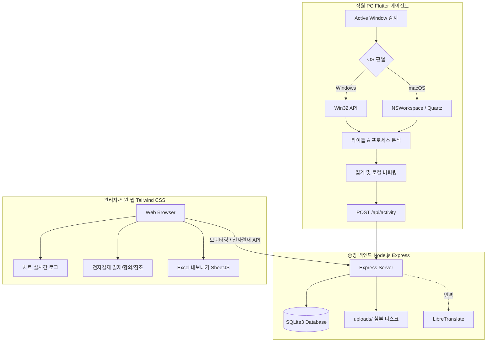

# 🛡️ PGuard: 직원 PC 활동 모니터링 & 사내 전자결재 통합 플랫폼

본 프로젝트는 직원들의 주요 업무 프로그램(Excel, PPT, Word, VS Code 등) 사용량과 웹 브라우저상의 비업무용 사이트(유튜브, 웹툰, 쿠팡 등) 체류 시간을 백그라운드에서 추적하고, 이를 관리자가 현대적인 대시보드 화면을 통해 분석·모니터링할 수 있도록 돕는 풀스택 솔루션입니다. 여기에 더해 **사내 전자결재(결재/합의/참조, 다국어 번역, 첨부파일) 시스템**을 통합하여, 관리자와 직원 모두가 결재 문서를 작성·승인할 수 있습니다.

> **에이전트 안내**: PC 활동 수집 에이전트는 **Flutter 기반 Windows/macOS 앱**(`pguard_agent_flutter/`)으로 제공됩니다. 기존 Python 에이전트는 제거되었습니다.

---

## 🏗️ 1. 전체 시스템 아키텍처 및 데이터 흐름



### 💡 주요 시스템 특징
1. **네이티브 OS API 연동**: Windows(`pywin32`) 및 macOS(`pyobjc-framework-Quartz`) 고유의 API를 통해 활성 창의 프로세스명과 타이틀을 리소스를 거의 소모하지 않고 정밀하게 추적합니다.
2. **5분 버퍼링 일괄 전송 (Batch Sending)**: 매 5초마다 전면 활성 창 상태를 수집하되, 에이전트의 오버헤드를 극도로 낮추기 위해 **5분(300초)** 분량의 데이터를 누적해 일괄 전송합니다.
3. **원격 비업무 사이트 관리**: 위반 웹사이트 판단 로직 및 리스트를 서버 단에서 조율하여 원격 제어 효율성을 극대화했습니다.
4. **회사 코드 연동 보안**: 에이전트 구동 및 대시보드 로그인 시 고유의 회사 코드를 매칭/인증하여 Multi-Tenant 격리 환경을 보장합니다.
5. **엑셀 다운로드 (SheetJS)**: 별도 서버 리소스 없이 프론트엔드단에서 즉각 실시간 전체 사원 상태 및 개별 사원 상세 통계(TOP 5 프로그램, 비업무 위반 도메인 리스트 포함), 전자결재 문서 목록 엑셀 파일 내보내기를 지원합니다.
6. **사내 전자결재 시스템**: 결재선(순차)·합의선(병렬)·참조선(읽음 표시) 워크플로우, 관리자 템플릿(동적 필드 빌더), 직원 로그인 및 관리자↔직원 모드 전환, LibreTranslate 기반 4개 언어(ko/en/th/lo) 자동 번역 병기, 서버 디스크 첨부파일(업로드/다운로드)을 제공합니다.
7. **통합 로그인 (단일 회사)**: 아이디·비밀번호만으로 로그인하며, 계정으로부터 소속 회사를 자동 판별합니다(회사 코드 입력 불필요). 관리자는 일부 직원에게 관리 권한(서브 관리자/직원 관리자)을 부여할 수 있습니다.

---

## 📂 2. 폴더 구조

```text
Back_PC/
├── pguard_agent_flutter/   # PC 활동 수집 에이전트 (Flutter, Windows/macOS)
│   └── lib/core/monitor/   # 활성 창 감지·분류·도메인 추출 로직
├── server/                 # 중앙 백엔드 API 서버 (Node.js & SQLite)
│   ├── package.json        # 의존성(express, sqlite3, bcryptjs, cors, multer)
│   ├── server.js           # REST API, SQLite 스키마/마이그레이션, 전자결재·번역·첨부
│   ├── seed.js             # 시뮬레이션용 대시보드 모의 데이터 주입 스크립트
│   ├── uploads/            # 전자결재 첨부파일 디스크 저장소 (git 미추적)
│   └── database.sqlite     # 로컬 경량 데이터베이스 파일 (자동 생성)
├── dashboard/              # 관리자·직원 웹 화면 (Frontend)
│   ├── index.html          # Tailwind CSS & SheetJS 기반 UI (모니터링 + 전자결재)
│   └── app.js              # API 연동, 차트, 전자결재 SPA, i18n(ko/en/th/lo)
├── USER_MANUAL.txt         # 세부 시스템 기능 및 배포 사용자 매뉴얼
└── README.md               # 시스템 설계 및 설치/구동 가이드 (본 파일)
```

---

## 🚀 3. 설치 및 구동 가이드

### 1단계: 백엔드 서버 (Node.js Express + SQLite)
**사전 요구사항**: PC에 [Node.js (LTS 버전)](https://nodejs.org)가 설치되어 있어야 합니다.

1. **의존성 라이브러리 설치**:
   ```bash
   cd server
   npm install
   ```
2. **시뮬레이션용 가상 데이터 주입 (Seed)**:
   대시보드를 처음 구동했을 때 다채로운 데이터 차트를 확인하기 위해 모의 데이터를 주입합니다.
   ```bash
   npm run seed
   ```
3. **개발 모드로 서버 실행**:
   ```bash
   npm run dev  # 또는 node server.js
   ```
4. **실운영 서버 상시 무중단 실행 (PM2 추천)**:
   ```bash
   npm install -g pm2
   pm2 start server.js --name "pguard-server"
   pm2 save
   pm2 startup
   ```

---

### 2단계: PC 활동 수집 에이전트 (Flutter, Windows/macOS)
현행 에이전트는 `pguard_agent_flutter/` 디렉토리의 **Flutter 데스크톱 앱**입니다. 빌드 스크립트로 각 OS용 실행 파일을 생성해 배포합니다.

```bash
cd pguard_agent_flutter
# Windows 빌드
./build_windows.sh
# macOS 빌드 (코드 서명은 CODE_SIGNING_GUIDE.md 참조)
./build_macos.sh
```
- 최초 실행 시 회사 코드/직원 정보를 입력하면 백그라운드에서 활성 창을 집계하여 서버(`POST /api/activity`)로 전송합니다.
- 다국어 UI(ko/en/th/lo) 지원, 상세 빌드/서명 절차는 `pguard_agent_flutter/README.md`, `CODE_SIGNING_GUIDE.md` 참조.

---

### 3단계: 관리자·직원 웹 화면 (Frontend)
백엔드 서버(3000 포트)가 `dashboard/`를 정적 제공하므로, 서버 실행 후 브라우저에서 **`http://localhost:3000`** 으로 접속하면 됩니다. (별도 정적 서버로 띄울 경우 `cd dashboard && npx -y http-server -p 8080`)

* **초기 로그인**: 아이디 `admin` / 비밀번호 `pguard1234` (단일 회사 운영이므로 회사 코드 입력 불필요).
* 로그인 후 관리자는 상단 토글로 **관리자 모드 ↔ 직원 모드**를 전환할 수 있으며, 직원은 직원 모드(나의 결재)만 사용합니다.
* 직원 로그인 계정 및 관리 권한 부여는 **전자결재 관리 → 직원 계정** 탭에서 설정합니다.

### 4단계: 번역 서버 LibreTranslate (선택 · 전자결재 다국어 번역용)
전자결재 문서 자동 번역 기능을 사용하려면 LibreTranslate 서버가 필요합니다(미설정 시 번역 기능만 비활성, 나머지는 정상 동작).

```bash
# Docker 예시 (ko/en/th 로드)
docker run -d -p 5000:5000 libretranslate/libretranslate --load-only ko,en,th
```
- 대시보드 **전자결재 관리 → 결재 설정**에서 서버 URL(예: `http://localhost:5000`) 입력 후 "연결 테스트" → 저장.
- 라오어(lo)처럼 직접 지원되지 않는 언어는 영어 경유 2단계 번역으로 자동 폴백합니다.

---

## 📈 4. 데이터베이스 및 API 세부 구성

### 🗄️ SQLite 데이터 테이블 스키마
* **`companies`**: 멀티테넌시 회사 코드 및 회사 정보 관리
* **`company_admins`**: 회사별 관리자 인증 계정(admin/sub_admin/employee_manager)
* **`employees`**: 사원 목록, 최종 통신 일시, **로그인 계정(`login_id`/`password_hash`/`is_login_enabled`)** 및 **부여 관리권한(`admin_role`)**
* **`activities`**: 에이전트가 집계·전송한 활동 로그 (카테고리: `work`, `non-work`, `idle`)
* **전자결재**: `approval_templates`(양식), `approval_documents`(문서), `approval_lines`(결재/합의/참조선), `approval_attachments`(첨부), `approval_activity_log`(이력), `approval_settings`(번역/접두사 설정)

### 🔗 주요 백엔드 REST API 목록
**모니터링**
* `POST /api/activity`: 에이전트 활동 전송 (회사 코드 유효성 자동 필터링)
* `GET /api/dashboard/stats`, `GET /api/employees/:id/stats`, `GET /api/dashboard/logs`: 대시보드 통계·로그 조회

**인증 (단일 회사: 회사 코드 생략 가능, 아이디로 회사 자동 판별)**
* `POST /api/admin/login`, `POST /api/employee/login`: 관리자/직원 로그인
* `POST /api/admin/employees/:id/account`, `PUT /api/admin/employees/:id/admin-role`: 직원 로그인 계정·관리권한 부여

**전자결재**
* `GET/POST/PUT/DELETE /api/approval/templates`: 결재 양식(템플릿) CRUD, `GET /api/approval/participants`: 결재선 대상 조회
* `POST /api/approval/documents`(작성/제출), `GET /api/approval/documents(/:id)`(목록/상세+읽음), `.../submit|withdraw|approve|reject|agree`: 문서 생애주기·결재 액션
* `GET /api/approval/pending|my-docs|cc-docs|stats`: 개인 뷰(대기/기안/참조/통계)
* `POST /api/approval/documents/:id/attachments`, `GET /api/approval/attachments/:id/download`, `DELETE ...`: 첨부 업로드/다운로드/삭제
* `POST /api/approval/translate`, `GET/PUT /api/approval/settings`, `POST /api/approval/translate/test`: LibreTranslate 번역·설정·연결 테스트

---

## 📄 5. 사용자 가이드 및 유지 보수
더욱 상세한 대시보드 조작법, Excel 내보내기 활용법, 실운영 서버 포트 및 클라우드(AWS EC2) 방화벽(Inbound TCP Port: 3000) 오픈 방법, 그리고 Nginx Reverse Proxy 설정법 등은 프로젝트 루트 폴더 내의 **[USER_MANUAL.txt](file:///d:/project/Back_PC/USER_MANUAL.txt)** 파일을 확인하시기 바랍니다.
