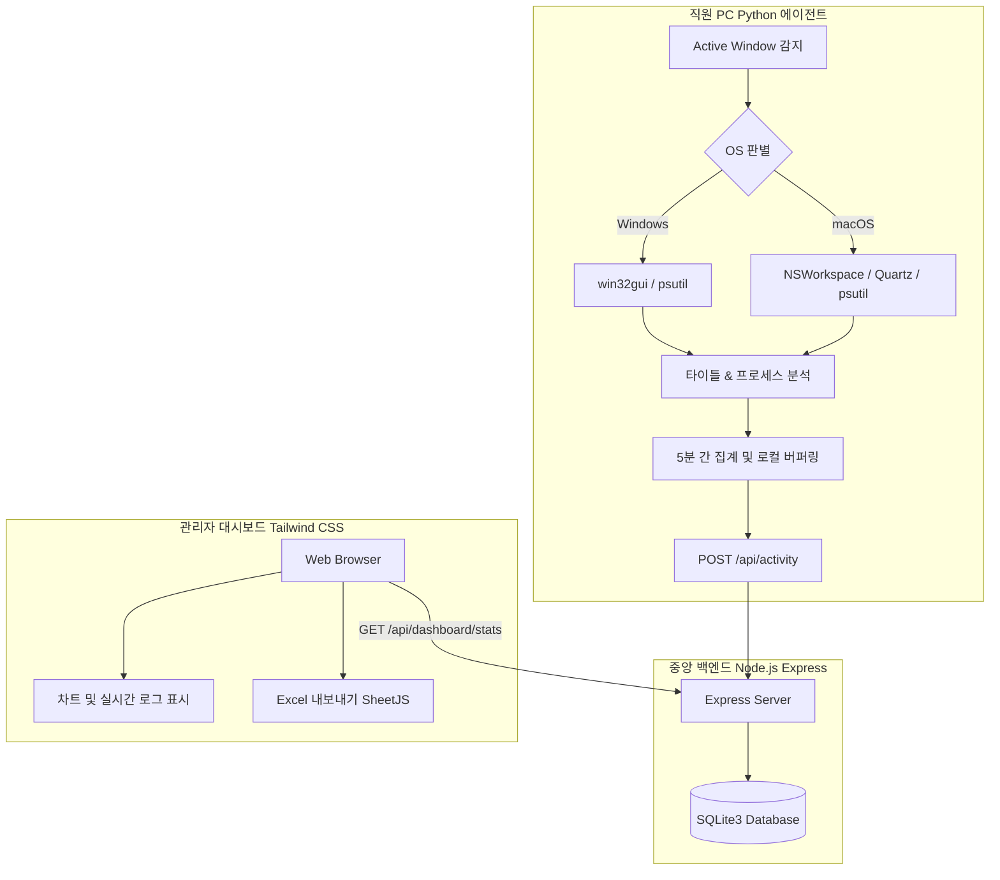

# 🛡️ PGuard: 직원 PC 활동 수집 에이전트 & 실시간 모니터링 대시보드

본 프로젝트는 직원들의 주요 업무 프로그램(Excel, PPT, Word, VS Code 등) 사용량과 웹 브라우저상의 비업무용 사이트(유튜브, 웹툰, 쿠팡 등) 체류 시간을 백그라운드에서 추적하고, 이를 관리자가 현대적인 대시보드 화면을 통해 분석·모니터링할 수 있도록 돕는 풀스택 솔루션입니다.

---

## 🏗️ 1. 전체 시스템 아키텍처 및 데이터 흐름



### 💡 주요 시스템 특징
1. **네이티브 OS API 연동**: Windows(`pywin32`) 및 macOS(`pyobjc-framework-Quartz`) 고유의 API를 통해 활성 창의 프로세스명과 타이틀을 리소스를 거의 소모하지 않고 정밀하게 추적합니다.
2. **5분 버퍼링 일괄 전송 (Batch Sending)**: 매 5초마다 전면 활성 창 상태를 수집하되, 에이전트의 오버헤드를 극도로 낮추기 위해 **5분(300초)** 분량의 데이터를 누적해 일괄 전송합니다.
3. **원격 비업무 사이트 관리**: 위반 웹사이트 판단 로직 및 리스트를 서버 단에서 조율하여 원격 제어 효율성을 극대화했습니다.
4. **회사 코드 연동 보안**: 에이전트 구동 및 대시보드 로그인 시 고유의 회사 코드를 매칭/인증하여 Multi-Tenant 격리 환경을 보장합니다.
5. **엑셀 다운로드 (SheetJS)**: 별도 서버 리소스 없이 프론트엔드단에서 즉각 실시간 전체 사원 상태 및 개별 사원 상세 통계(TOP 5 프로그램, 비업무 위반 도메인 리스트 포함) 엑셀 파일 내보내기를 지원합니다.
6. **macOS 원클릭 설치 지원**: 더블 클릭 한 번만으로 Python 의존성 설치, LaunchAgent 서비스 등록, 보안 속성 격리 우회를 한 번에 수행하는 인스톨러(`install_mac.command`)를 지원합니다.

---

## 📂 2. 폴더 구조

```text
Back_PC/
├── agent/                  # 크로스플랫폼 PC 활동 수집기 (Python)
│   ├── requirements.txt    # 의존성 정의 파일
│   ├── agent.py            # 에이전트 메인 소스 코드 (OS 분기 및 버퍼링 탑재)
│   └── install_mac.command # macOS용 원터치 자동 설치 스크립트 [NEW]
├── server/                 # 중앙 백엔드 API 서버 (Node.js & SQLite)
│   ├── package.json        # 의존성 라이브러리 및 스크립트 정의
│   ├── server.js           # REST API 및 SQLite 스키마 초기화 소스
│   ├── seed.js             # 시뮬레이션용 대시보드 모의 데이터 주입 스크립트
│   └── database.sqlite     # 로컬 경량 데이터베이스 파일 (자동 생성)
├── dashboard/              # 관리자 웹 모니터링 화면 (Frontend)
│   ├── index.html          # Tailwind CSS & SheetJS 기반 대시보드 UI 마크업
│   └── app.js              # API 연동, 실시간 차트 업데이트 및 Excel 다운로드 스크립트
├── USER_MANUAL.txt         # 세부 시스템 기능 및 배포 사용자 매뉴얼
└── README.md               # 시스템 설계 및 설치/구동 가이드 (본 파일)
```

---

## 🚀 3. 설치 및 구동 가이드

### 1단계: 백엔드 서버 (Node.js Express + SQLite)
**사전 요구사항**: PC에 [Node.js (LTS 버전)](https://nodejs.org)가 설치되어 있어야 합니다.

1. **의존성 라이브러리 설치**:
   ```bash
   cd server
   npm install
   ```
2. **시뮬레이션용 가상 데이터 주입 (Seed)**:
   대시보드를 처음 구동했을 때 다채로운 데이터 차트를 확인하기 위해 모의 데이터를 주입합니다.
   ```bash
   npm run seed
   ```
3. **개발 모드로 서버 실행**:
   ```bash
   npm run dev  # 또는 node server.js
   ```
4. **실운영 서버 상시 무중단 실행 (PM2 추천)**:
   ```bash
   npm install -g pm2
   pm2 start server.js --name "pguard-server"
   pm2 save
   pm2 startup
   ```

---

### 2단계: 크로스플랫폼 에이전트 (Python 3)
**사전 요구사항**: PC에 [Python 3.8 이상](https://www.python.org/downloads/)이 설치되어 있어야 합니다.

#### 💻 Windows 환경 설치
1. **에이전트 폴더로 이동**:
   ```bash
   cd agent
   ```
2. **의존성 및 라이브러리 설치**:
   ```bash
   pip install -r requirements.txt
   pip install pywin32
   ```
3. **에이전트 백그라운드 구동**:
   ```bash
   pythonw agent.py
   ```

#### 🍎 macOS 환경 설치 (원터치 원클릭)
일반 직원은 복잡한 터미널 명령어 입력 필요 없이, 제공되는 `install_mac.command`를 **더블 클릭**하는 것만으로 다음과 같은 과정이 자동 실행됩니다.
- Python 3 및 pip 존재 검출 및 자동 셋업
- 필수 외부 모듈(`requests`, `psutil`, `pyobjc`) 일괄 설치 및 업그레이드
- macOS Gatekeeper 격리 속성 우회 명령어(`xattr -d com.apple.quarantine`) 및 실행 권한 자동 부여
- 로그인 시 백그라운드 구동을 보장하는 macOS LaunchAgent 서비스(`com.pguard.agent.plist`) 자동 등록 및 구동
- 최초 실행 및 회사코드 입력 GUI 창 즉각 팝업 기동 연계

---

### 3단계: 관리자 웹 대시보드 (Frontend)
대시보드 화면은 별도의 서버 빌드 없이 브라우저로 띄우거나 개발 서버로 간편하게 실행할 수 있습니다.

* **간편 실행**: `dashboard/index.html` 파일을 크롬 등 웹 브라우저에서 **더블 클릭(로컬 열기)**하여 실행합니다.
* **라이브 서버 실행 (추천)**: VS Code의 `Live Server` 확장 프로그램을 쓰거나 `npx`를 사용해 임시 로컬 서버를 가동하면 API 통신이 더욱 매끄럽습니다.
  ```bash
  cd dashboard
  npx -y http-server -p 8080
  ```
  * 그 후 웹 브라우저에서 `http://localhost:8080`에 접속합니다.

---

## 📈 4. 데이터베이스 및 API 세부 구성

### 🗄️ SQLite 데이터 테이블 스키마
* **`companies`**: 멀티테넌시 회사 코드 및 회사 정보 관리
* **`admins`**: 회사별 독립된 대시보드 관리자 인증 계정 정보
* **`employees`**: 사원 목록 및 최종 통신 일시 보관
* **`activities`**: 에이전트가 5초 간격으로 집계하고 5분마다 전송한 로우(Raw) 활동 로그 (카테고리: `work`, `non-work`, `idle`)

### 🔗 주요 백엔드 REST API 목록
* `POST /api/activity`: 에이전트 활동 전송 엔드포인트 (회사 코드 유효성 자동 필터링 탑재)
* `GET /api/dashboard/stats`: 실시간 직원 온라인 현황, 누적 근무/비업무/자리비움 비중, 프로그램 점유율 랭킹, 상위 비업무 도메인 목록 일괄 조회
* `GET /api/employees/:employeeId/stats`: 특정 사원의 집중도 점수, 누적 사용 프로그램 TOP 5, 비업무 위반 도메인 TOP 5 및 누적 방문수 개별 심층 조회
* `GET /api/dashboard/logs?non_work_only=true`: 실시간 로그 모니터링 피드 (비업무 위반 로그 필터링 지원)

---

## 📄 5. 사용자 가이드 및 유지 보수
더욱 상세한 대시보드 조작법, Excel 내보내기 활용법, 실운영 서버 포트 및 클라우드(AWS EC2) 방화벽(Inbound TCP Port: 3000) 오픈 방법, 그리고 Nginx Reverse Proxy 설정법 등은 프로젝트 루트 폴더 내의 **[USER_MANUAL.txt](file:///d:/project/Back_PC/USER_MANUAL.txt)** 파일을 확인하시기 바랍니다.
